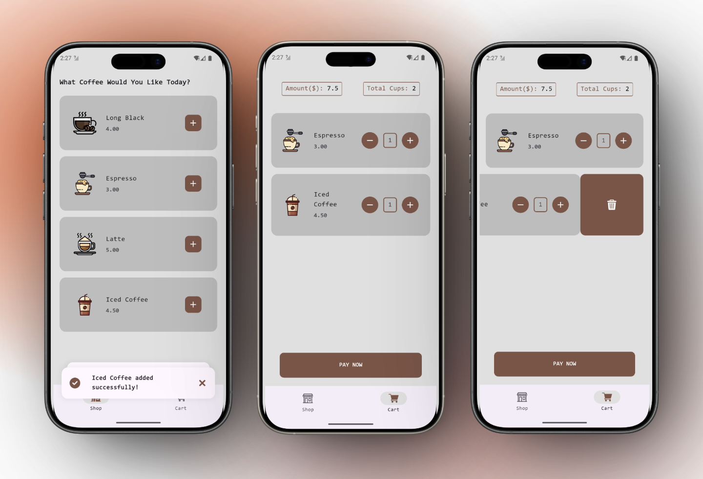

#   CAFEY APP

___Cafey___ is a simple __coffee app__ built with __Dart__ and __Flutter__. It lets you pcik among four available types of coffee, select the number of cups you desire, and proceed with payment finalization (no backend integration. Just a frontend demo). It features a simple UI and UX that lets you add coffee type to cart, increment or decrement number of cups, and remove coffee types entirely from cart.  

---
  
 
Feel free to use this **codebase** and modify the resulting **app** as you see fit. [;)] 
